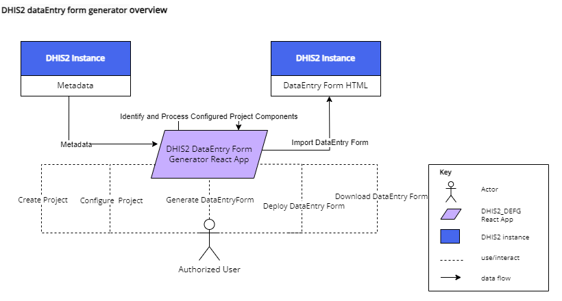
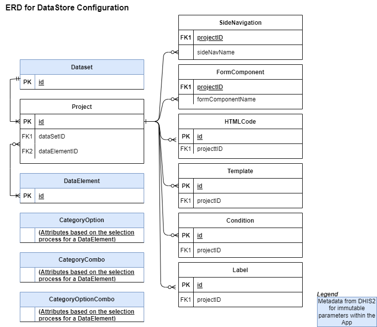

# Form Forge – DATIM Adaptation
---
## Goal 
Automatically generate DHIS2 custom forms to adapt DATIM UI layout. Data for Accountability Transparency and Impact (DATIM) is the PEPFAR-specific version of DHIS2 and is used to collect data

## Requirements
-	DHIS2 instances that are set up according to the metadata model.
-	Metadata: DataSet, DataElements, CategoryCombos, Categories, CategoryOptions, OrganizationUnit.
-	Access to DHIS2 instances (username and password).
-	DHIS2 aggregate configuration skills or training.

### Server Resources
For a DHIS2 React app, the server resources required can vary depending on the scale of the application and the volume of data being handled. However, for basic minimum requirements, you can start with:
Minimum: 16 GB of memory
Minimum: 4 vCPUs
It's important to note that these are the minimum requirements and depending on the complexity and scale of your DHIS2 React app, you might need to scale up further. For pre-existing metadata or larger use cases, it might be necessary to increase the resources to:
Recommended: 32 GB of memory or more
Recommended: 8 vCPUs or more
These server resources are essential for ensuring smooth performance and efficient handling of metadata and data within the DHIS2 React app. Adjustments may be necessary based on usage patterns and growth over time. 

## Overview

---

## Model Views and Processes 
### DHIS2 Metadata model
1. Datasets: Datasets in DHIS2 represent collections of related data elements. 
2. Data Elements: Data elements represent the smallest unit of data captured in DHIS2. 
3. Category Options: Category options provide additional categorization or classification for data elements. 
4. Category Combos: Category combos are used to define combinations of categories that are relevant for data analysis or reporting.
5. Category Option Combos: Category option combos represent specific combinations of category options within a category combo. 
6. Data Entry Form: A Data Entry Form is a user interface component generated based on the metadata model. It provides a structured way for users to input data into the system.

### DataStore Model
The entities are derived from the datastore objects, and their relationships are based on the shared projectID that connects them.

#### Entities:
1.	Project (from 'custom-form-generator')
2.	SideNavigation (from 'custom-navigations-form-generator')
3.	FormComponent (from 'custom-components-form-generator')
4.	Template (from 'custom-templates-form-generator')
5.	Condition (from 'custom-conditions-form-generator')
6.	LabelName (from 'custom-labelName-form-generator')
7.	HTMLCode (from 'custom-htmlCodes-form-generator')

 'custom-form-generator' holds the projects and associated data created. This is the building block. A major component of the field is the id field. The id field is associated to all other datastore objects above (config). It is represented as projectID in all datastore objects. The dataElement field will hold all the dataElements associated to a project. Each associated dataElement could be associated to a side navigation and form component.
Each category option desired for the dataEntry form is selected or removed at the levels of the Category Combinations aligned as HorizontalLevel0, HorizontalLevel1, verticalLevel1, verticalLevel2, verticalLevel3 or verticalLevel4 as the case maybe. There is a DHIS2 UI transfer component that supports the selection.  
After a data element has been selected for configuration. The Category Option Combination for that dataElement is queried for the user to select the Category at each level. This will now allow using the UI transfer component to select desired category options at each level.
After completing the selections and updating 'custom-form-generator', the dataElements object in 'custom-form-generator' looks like below.

        {
            "dataElements":[        
                            {	...
				
                                "sideNavigation":  ... ,
                            	"formComponent": ...  ,
                            	"HorizontalLevel0": {                  
                                        ...
                                },
                            	"HorizontalLevel1": { ...                                
                                },                            	
                                "verticalLevel1": : { ...                                
                                }, 
                           	    "verticalLevel2": : { ...                                
                                }, 
                            	"verticalLevel3": : { ...                                
                                }, 
                            	"verticalLevel4": : { ...                                
                                }, 
                            }
                        ]
        }
A CoC template can be created to reduce the work in adding another data Element that is required to use the same The Category Option Combination. The data is saved as above also but in another datastore Object called 'custom-templates-form-generator',
When generating the data entry form, the application will need to know the location in the form to place the data element and options using the Side Navigation ('custom-navigations-form-generator') and the Form Component ('custom-components-form-generator'). The form component is a collapsible in the data entry form that groups the data elements together in the form.

There might be need for special conditions. For example, excluding some age categories in the generated HTML template. The 'custom-conditions-form-generator' datastore helps with that. These conditions can be applied to Data Elements and Category Options.

For re-labelling the Data Elements and Category Options to ensure that it is more descriptive to the end users, 'custom-labelName-form-generator' holds the data that will rename the metadata in the data Entry form. 

All generated data entry forms are stored in 'custom-htmlCodes-form-generator'. It is from this list that the data entry forms are downloaded or posted to DHIS2 directedly. This store helps for history tracking and revival if need be.
 

#### Relationships:
Each Project can have multiple SideNavigations, FormComponents, Templates, Conditions, LabelNames, and HTMLCodes, hence a one-to-many relationship exists between Project and these entities.
DataElements are part of the Project entity, and their configuration includes references to SideNavigations and FormComponents.
CategoryOptionCombos are linked to DataElements for selection of Category at each level.

Attributes for each entity are derived from the fields listed in the various export const filters, and relationships are inferred from the description.

### Process
Below shows the sequence of interaction as displayed in the Activity diagram.

The approach relies on a metadata model using Datasets, Data Elements, Category Options, Category Combos, and Category Option Combos.
-	Data Elements are provisioned from the list of data elements assigned to the desired dataset in a DHIS2 instance.
-	A Category is assigned to a level from the Category Combo assigned to the Data Element.
-	Category Options are either included or excluded for processing for a desired level.
-	A DataEntryForm is generated for import. 

### Application Summary
An authorized user logged into the application and sees a table of all existing projects in the application. When no project exists, the user can create a new project by providing a unique name (it is validated by the application to ensure that the name is unique) and selecting a dataset that the project would be associated to. 
The user can rename, make a copy of the project, edit, and delete the project from the displayed table by clicking on the corresponding buttons. A filter appears on the page to filter the project. The data is stored in DHIS2 datastore.

The core function of the application is to edit the project.
There are 5 top navigation tabs.
-	Existing Data Elements
-	Configure Form Components
-	Configure Data Elements
-	Templates
-	Exclusion Rules
-	Labels

Existing Data Elements Tab
-	It contains the list of the data elements that would be processed when generating a Data Entry Form.
-	A data element that is intended to be added in the Data Entry form can be added from here.
-	The list can be filtered.
-	The data elements can be re-ordered.
-	The data element can be removed from the list. 

Configure Form Components Tab
-	It contains a list of Side Navigations and Form Components
-	The DATIM template contains side navigations, to ensure that data elements are grouped together.
-	The form navigation is the collapsible sections in the form to improve the UI complexities and form length.

Configure Data Elements Tab
-	The data elements to be included in the form will be configured here.
-	There are a maximum of 6 levels that exist here to aid the arrangement of the CoCs in the generated data entry form.
-	Templates, side navigations and form components can be applied to the data elements.
-	This also provides the interface to edit data elements.

CoC Templates Tab
-	The CoC templates created will be listed here.
-	The templates here only represent the CoC templates associated to the projects.
-	If there is a need to remove a template, it can be done here.

Exclusion Rules Tab
-	It contains the list of conditions that would be processed when generating a Data Entry Form.
-	The logics needed to be rendered in the Data Entry Form can be configured here. 
-	If there is a need to remove a condition, it can be done here.

Labels Tab
-	It contains the list of labels that would be processed when generating a Data Entry Form.
-	The labels needed for renaming data elements or category options in the Data Entry Form can be configured here. 
-	If there is a need to remove a label, it can be done here.

After the configuration of the data elements and the associated projects components, the authorized used can generate a data entry form. This previous data entry form in the dataset is saved in the history list for roll back if needed.

---

## Installation
Installing the built application is easy. Follow the steps below:
1.	Log in to your DHIS2 instance as a superuser or user with appropriate permissions.
2.	Navigate to the “App Management” section in DHIS2.
3.	From the navigation, select “Manual install”.
4.	Upload the built application form your device by clicking on “Upload an app to install” button.
5.	Select the built bundle and the application will be installed into DHIS2.
6.	Confirm installation by navigating to “Custom apps” and then locate “Form Forge”.

## Configuration
This project was bootstrapped with [DHIS2 Application Platform](https://github.com/dhis2/app-platform).

### Pre-requisite
1.	Install VS Code
https://dhis2-app-course.ifi.uio.no/learn/getting-started/development-setup/editor/vs-code/

2.	Install NodeJS
https://dhis2-app-course.ifi.uio.no/learn/getting-started/development-setup/nodejs/node-installation/

3.	Yarn is an alternative NodeJS package manager and is used by many projects, including many of DHIS2's own libraries and applications.
https://dhis2-app-course.ifi.uio.no/learn/getting-started/development-setup/nodejs/yarn-installation/

4.	Follow the application development process in DHIS2 with https://developers.dhis2.org/docs/app-platform/getting-started 
5.	or in uio https://dhis2-app-course.ifi.uio.no/learn/dhis2/getting-started/app-dev-tools/ 
6.	install dhis2 dependencies.
https://dhis2-app-course.ifi.uio.no/learn/dhis2/getting-started/development-environment/development-env-setup/ 

### Clone project.
7.	Create a new folder with a name of your choice. We have chosen AppStore.  cd into the new folder "AppStore"
8.	Clone project from https://github.com/FHI360/custom_form_generator.git  
git clone https://github.com/FHI360/custom_form_generator.git 
Using Windows
9.	add …\AppData\Local\Yarn\bin to path   https://community.dhis2.org/t/d2-cli-not-recognized/49768/3

### Install dependencies
10.	yarn add --dev @dhis2/cli-app-scripts
11.	d2 app scripts init custom-form-gen
12.	cd custom-form-gen
13.	run "yarn add @dhis2/cli-style –dev or yarn add @dhis2/cli-style -D"
14.	run "yarn d2-style add eslint react"
15.	run "yarn d2-style install"

        // package.json
        {
            // ...
            "scripts": {
                // ...
                "lint": "yarn d2-style check",
                "lint:staged": "yarn lint --staged",
                "format": "yarn d2-style apply",
                "format:staged": "yarn format --staged"
            }
        }

16.	run "yarn lint"
17.	run "yarn format"

18.	To test run  "yarn start --proxy https://play.dhis2.org/2.38.5 --proxyPort 8082"

https://github.com/dhis2/academy-web-app-dev-2022/blob/main/resources/GET_STARTED.md#start-your-dhis2-application-locally 

19.	Log into DHIS2 instance.

 
### Building a ZIP file
20.	run "yarn build"
21. locate zip bundle in "custom-form-gen/build"

### Resources

* https://docs.dhis2.org/en/develop/using-the-api/dhis-core-version-240/metadata.html
* https://dhis2designlab.github.io/

